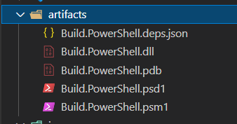
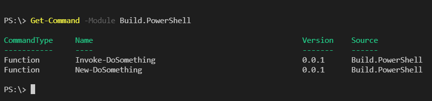
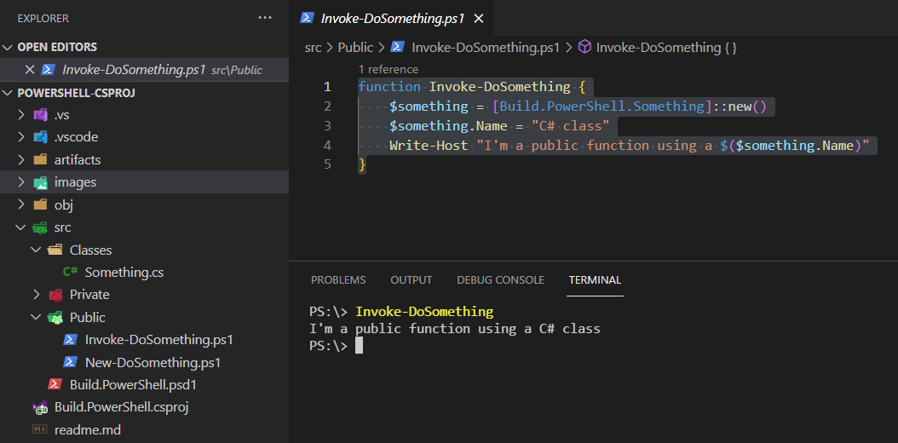
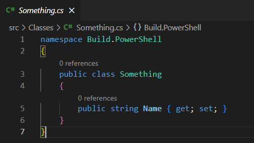

# Build.PowerShell

## Description

Build PowerShell is proof of concept project to give PowerShell a first class build experience.

## Business Problem

When looking at some of my favorite PowerShell modules to see how they chose to handle breaking code into consumable chunks I usually see something like this project.
The problem is, how do I put it all back together when it is time to package everything?
A lot of the time their answer is to create a "Merge-Files.ps1" or something of that manner.

## Requirements

- Install the newest PowerShell - [Link](https://github.com/PowerShell/PowerShell#get-powershell)
- Install Dotnet Cli & SDK - [Link](https://dotnet.microsoft.com/download)

## Building the Module

```powershell
# Just use a basic dotnet build command
# Make sure you are in the same directory as the csproj file
dotnet build "Build.PowerShell.csproj"
```

You should end up with something like this:



- Inspecting the module

```powershell
Import-Module .\artifacts\Build.PowerShell.psd1
Get-Command -Module Build.PowerShell
```



- Using the module



- .Net model class



## How Does it Work

The merging of the files is handled in the csproj file using the [ReadLinesFromFile](https://docs.microsoft.com/en-us/visualstudio/msbuild/readlinesfromfile-task)
and [WriteLinesToFile](https://docs.microsoft.com/en-us/visualstudio/msbuild/writelinestofile-task) tasks. There are more detailed notes in the file itself.
Private functions do not get exported due to the psd1 file targeting functions with the `'*-*'` pattern but private functions follow 
a `_privateFunction` naming convention.

Another neat feature is that now we can use .Net classes for our model objects.
This unlocks a lot more features like interfaces and namespaces that PowerShell classes don't have.

___
